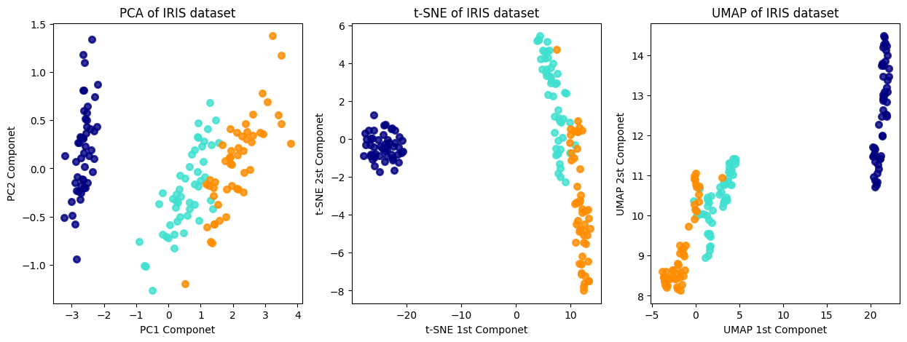
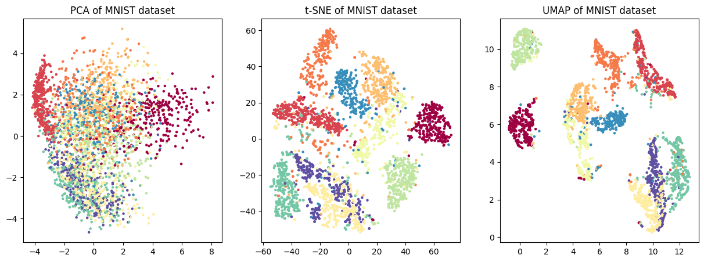
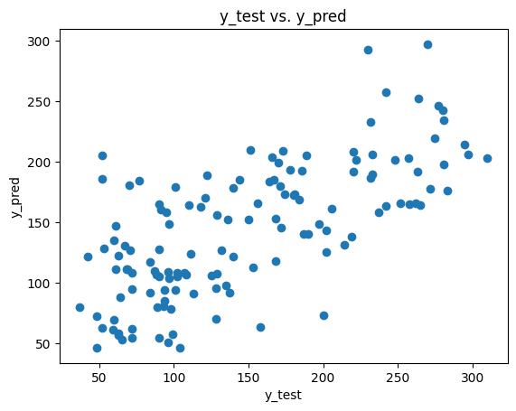
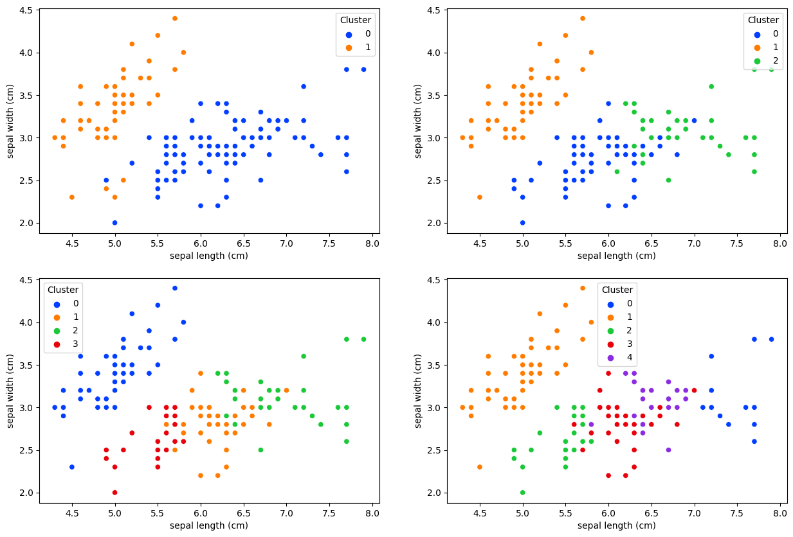

# DataScience_MidCourse_12_21
통계 분석, 차원 축소, 회귀 분석, 머신러닝 실습 포함

# 데이터 사이언스 중급 과정 (12_21)

## 📌 개요
2023년 12월 21에 이 프로젝트는 **데이터 사이언스 중급 과정**에서 수행한 실습 코드입니다.
다양한 데이터 분석 및 머신러닝 기법을 적용하며, 주요 개념을 실습을 통해 학습하였습니다.

## 🛠️ 사용한 기술
- **통계 분석**: 상관관계 분석, 평균 분석(T-test), 분포 검정(KS-test)
- **차원 축소**: PCA, t-SNE, UMAP을 이용한 데이터 시각화
- **회귀 분석**: 선형 회귀 및 다중 선형 회귀를 이용한 예측 모델 구축
- **머신러닝**: KNN 분류 모델, K-Means 클러스터링
- **데이터 시각화**: Matplotlib, Seaborn을 활용한 다양한 데이터 시각화

---

## 🔹 주요 실험 내용

### 1️⃣ 통계 분석 (T-test & KS-test)
- 특정 변수 간의 평균 차이를 검정 (p-value 활용)
- KS-test를 이용하여 데이터의 분포 비교

#### ✔️ 실행 코드 예시
```python
from scipy.stats import ttest_ind, ks_2samp

# 두 그룹 간 평균 비교 (T-test)
setosa = subset_df[subset_df['species'] == 'setosa'][feature]
versicolor = subset_df[subset_df['species'] == 'versicolor'][feature]
t_stat, p_val = ttest_ind(setosa, versicolor)
print(f'T-test p-value: {p_val}')

# 분포 비교 (KS-test)
ks_stat, p_val = ks_2samp(setosa, versicolor)
print(f'KS-test p-value: {p_val}')
```

---

### 2️⃣ 차원 축소 및 데이터 시각화
- PCA, t-SNE, UMAP을 이용하여 고차원 데이터를 저차원으로 변환하여 시각화

#### ✔️ 실행 코드 예시
```python
from sklearn.decomposition import PCA
from sklearn.manifold import TSNE
from umap import UMAP

# PCA 실행
pca = PCA(n_components=2)
X_pca = pca.fit_transform(X)

# t-SNE 실행
tsne = TSNE(n_components=2, random_state=0)
X_tsne = tsne.fit_transform(X)

# UMAP 실행
umap = UMAP(n_components=2, random_state=0)
X_umap = umap.fit_transform(X)
```

#### 📊 시각화 결과



---

### 3️⃣ 선형 회귀 분석 (부동산 가격 예측 등)
- 선형 회귀 모델을 사용하여 예측 수행
- 다중 회귀 분석을 통해 변수 중요도 확인

#### ✔️ 실행 코드 예시
```python
from sklearn.linear_model import LinearRegression
from sklearn.metrics import mean_squared_error, r2_score

# 모델 생성 및 훈련
model = LinearRegression()
model.fit(X_train, y_train)

# 예측 수행
y_pred = model.predict(X_test)

# 성능 평가
mse = mean_squared_error(y_test, y_pred)
r2 = r2_score(y_test, y_pred)
print(f'Mean Squared Error: {mse}')
print(f'R2 Score: {r2}')
```

#### 📊 시각화 결과


---

### 4️⃣ 머신러닝 분류 및 클러스터링
- KNN 분류 모델을 사용하여 데이터 분류
- K-Means 클러스터링을 통해 데이터 군집화

#### ✔️ 실행 코드 예시 (K-Means)
```python
from sklearn.cluster import KMeans
from sklearn.metrics import silhouette_score

# K-Means 클러스터링 실행
kmeans = KMeans(n_clusters=3, random_state=42)
labels = kmeans.fit_predict(X)

# 실루엣 점수 계산
score = silhouette_score(X, labels)
print(f'Silhouette Score: {score}')
```

#### 📊 시각화 결과


---

## 📂 프로젝트 파일 구성
- `data_science_mid_12_21.ipynb` : 데이터 사이언스 중급 과정 실습 코드
- `README.md` : 프로젝트 개요 및 설명
- `이미지결과_1.png ~ 이미지결과_4.png` : 실험 결과 시각화 이미지

---

## 🔗 관련 사항
이 프로젝트는 데이터 사이언스 중급 과정 수료 과정에서 작성된 코드입니다.
